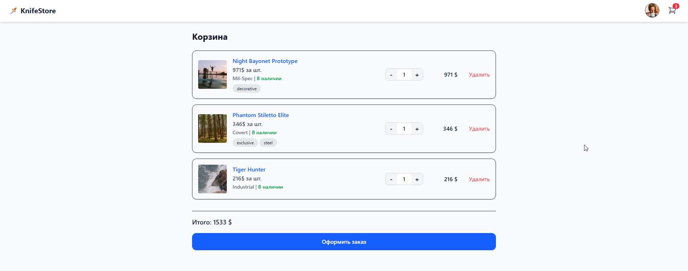

# 🛍️ Vue Store (Knife-themed Demo)

Демо интернет-магазина на Vue 3 с каталогом, фильтрами, корзиной и оформлением заказа.
Проект сделан как портфолио с упором на архитектуру, типизацию и работу с API.

Деплой GitHub Pages через bash скрипт [deploy.sh](deploy.sh) с фиксом для SPA для статичного хостинга.

[DEMO HERE](https://lazenyuk-dmitry.github.io/tt_vue_store)

---




---

## 🚀 Стек

- Vue 3 (Composition API)
- Vite
- TypeScript
- TailwindCSS
- Axios
- vite-plugin-mock (mock API)

---

## ✨ Функционал

- 📦 Каталог товаров
- 🔎 Поиск и фильтры (наличие, сортировка)
- ♾️ Ленивый скролл (load more)
- 🛒 Корзина (изменение количества)
- 🧾 Checkout (оформление заказа)
- 🔐 Авторизация (mock)
- ⚡ Имитация API

---

## 📂 Структура проекта

```
src/
  api/           # работа с API
  components/    # UI компоненты
  pages/         # страницы
  composables/   # useCatalog, useCart и т.д.
  router/        # vue-router
mock/            # mock API (vite-plugin-mock)
```

## ⚙️ Переменные окружения

Создай `.env`:

```bash
VITE_BASE_URL=/tt_vue_store
VITE_USE_MOCK=true
```

---

## ⚙️ Установка и запуск

```bash
npm install
npm run dev
```

---

## 🏗️ Сборка

```bash
npm run build
```

## 🔌 API

В проекте используется mock API:

```
POST   /api/login
POST   /api/logout
GET    /api//userinfo
GET    /api/products
GET    /api/products/[id]
GET    /api/cart
POST   /api/cart/add
POST   /api/cart/remove
POST   /api/cart/update
POST   /api/cart/clear
POST   /api/checkout
```

В dev используется `vite-plugin-mock`, в prod — mock подключается в браузере.

---

## 🧠 Особенности

- Полностью типизированный API слой
- Разделение Product / CartProduct
- Composables вместо глобального store
- Mock сервер для изоляции фронта
- Подготовка под реальный backend
